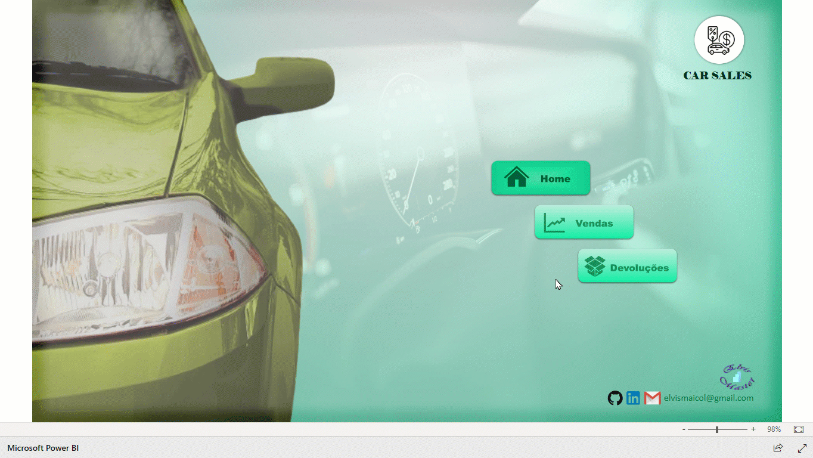
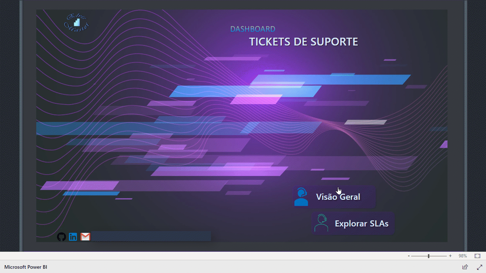

## Dashboards Desenvolvidos com POWER BI

### Olá!!! 👋

Esse repositório contém os links de alguns dos meus projetos desenvolvidos usando a ferramenta Power BI.  
 

### 🛠️ Tecnologias utilizadas

* [Power BI](https://powerbi.microsoft.com/pt-br/)

 

### 📌 Visualização

#### <a href="https://app.powerbi.com/view?r=eyJrIjoiOGUxMTcyYjgtMzcyZC00MWVmLTg0YzQtNjdmZmIxYzJmNmY3IiwidCI6IjgwZjA5NzYyLWQ5YzAtNDQzZS1iMGFlLTRlOGFiNTdmY2ExOCJ9" rel="nofollow">Dashboard Car Sales [Acesse Clicando Aqui] </a>.
(Dashboard de controle de Vendas e Devoluções)

 

#### <a href="https://app.powerbi.com/view?r=eyJrIjoiZjhlMWMyODAtNDRhNi00Nzc1LWFmYjEtMDNlNGIwNDk4YjNmIiwidCI6IjgwZjA5NzYyLWQ5YzAtNDQzZS1iMGFlLTRlOGFiNTdmY2ExOCJ9&pageName=ReportSection28afd6d25ddc1bb64d07" rel="nofollow">Business Case - Chamados de Suporte (SAC) [Acesse Clicando Aqui]</a>.
(Dashboard de Atendimento de Chamados de Suporte (SAC) com SLA)

 

